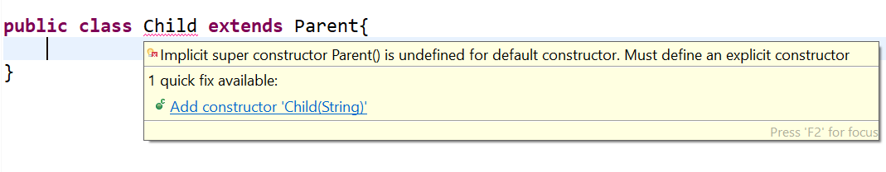

# U9L2: Writing Constructors for Subclasses

---
# Constructors are not inherited

**Inherited**  

1. All `public` and `protected` attributes and methods.
2. `default` attributes and methods as long as the subclass is in the same package as the superclass.

**Not Inherited**  

1. Constructors
2. All `private` attributes and methods.
3. `default` attributes and methods if the subclass is in a different package than the superclass.

As we saw in the previous lab, we can still invoke the superclass constructor by calling `super()`, but technically this doesn't count as being *inherited*. **Watch out for this on multiple choice problems.**

---
# Eclipse Error Flag

Suppose we define the following class named `Parent` that we will extend to create a subclass named `Child`:

	!Java
	public class Parent{
		protected String name;
		public Parent(String name){
			this.name = name;
		}
	}
	/*-------------------*/
	public class Child extends Parent{
		// TODO: Implement Class
	}

Eclipse flags the `Child` class right away with the following error:  

---
# What does that mean?

> Implicit super constructor Parent() is undefined for default constructor. Must define an explicit constructor.

How did we fix this in the lab? By defining an explicit constructor:  
	
	!Java
	public Child(String name){
		super(name);
	}

---
# What does that mean?
To fully understand why this is necessary and what the error message is saying, we need to understand the following 3 concepts. 
 
1. Default constructors.
2. Why calling the super constructor is necessary.
3. Implicit vs. Explicit super constructor calls.

---
# Default Constructors (Review)

A **default constructor** is a no argument constructor generated by the compiler when no explicit constructors have been provided. For example if we define the following class with out a constructor: 

	!Java
	class Pizza{
		int num;
		String str;
		
		public void printInfo(){
			System.out.println("num: " + num + ", str: " + str);
		}
	}

We are still able to instantiate this class thanks to the *default constructor*  

	!Java
	Pizza pizza = new Pizza();
	pizza.printInfo();
	
---
# No Default Constructor here

If we define at least 1 constructor, the default constructor will **not** be generated. For example if the following constructor were in the `Pizza` class 

	!Java
	public class Pizza{
		int num;
		String str;
		
		public Pizza(int num, String str){
			this.num = num;
			this.str = str;
		}
		
		public void printInfo(){
			System.out.println("num: " + num + ", str: " + str);
		}
	}
	
Then we couldn't create an object using the no argument constructor  
`Pizza pizza = new Pizza()` without explicitly defining one.

---
# Why call the super constructor?

When we inherit a class in Java we say the inherited class `extends` the superclass. The `extends` keyword is well-chosen since the subclass should only include the following code:  

1. Specific attributes not relevant to the superclass.
2. Specific methods not relevant to the superclass.
3. Methods that need to customized to work with the subclass. (Overrides)

All the common code defined in the superclass is not written in the subclass. It is isn't possible to construct a subclass object without constructing a superclass object first and adding the new features to it.  
 
---
# Implicit vs. Explicit Calls

For this reason, the Java compiler will look to see if you made a call to `super()` on the first line of your constructor(s) (Explicit Super Constructor Call). If you did not, it will attempt to implicitly call `super()` with no arguments before running any of your other code.  

**Implicit Call:** Even super classes include this implicit call. This is because all classes are inherited from the `Object` class.

	!Java
	public class Parent{
	public Parent(String name){
		// super(); <- will call new Object() automatically before setting name
		this.name = name;
	}

---
# Error Explained

When you do not write a constructor, the compiler attempts to call `super()` when executing the default constructor. This is the source of the error.
  
	!Java
	public class Parent{
		protected String name;
		public Parent(String name){
			this.name = name;
		}
	}
	/*-------------------*/
	public class Child extends Parent{
		// TODO: Implement Class
	}

Child has no constructor yet. When this code compiles the following will happen.

1. The compiler generates a default constructor `Child()`
2. This constructor implicitly calls `Parent()` however `Parent()` doesn't exist, only `Parent(String name)`. 

---
# Error Explained

1. The compiler generates a default constructor `Child()`
2. This constructor implicitly calls `Parent()` however `Parent()` doesn't exist, only `Parent(String name)`. 

In other words: 
> Implicit super constructor Parent() is undefined for default constructor. Must define an explicit constructor.

---
# Demonstrate Implicit Calls

To verify this is happening we can insert `println` statements in the beginning of our constructors to verify the order in which they executed.  

---
# Takeaways

* We only need to explicitly call `super()` if we are passing parameters to the super constructor.
* Explicit calls to `super()` must occur on the first line of the constructor.
* Implicit calls to `super()` will not work if a no argument constructor doesn't exist. 

Practice Problems

