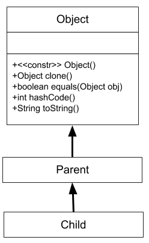
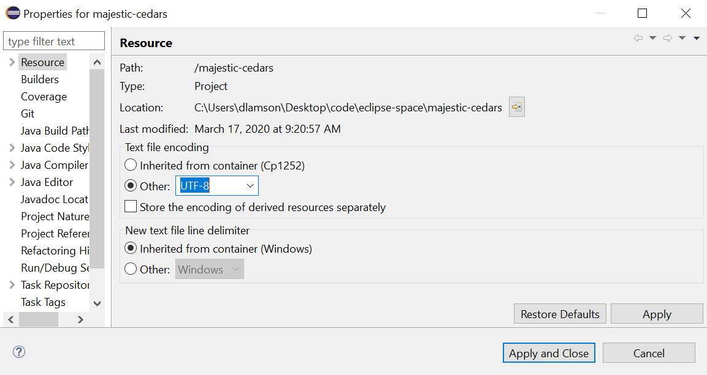

# U9L4: The `Object` class
## Everyone's favorite SUPERCLASS :)

---
# the `Object` class

In Java, every class that doesn't explicitly extend another class, implicitly extends the `Object`.  
The `Object` class includes several inherited methods that we will look at closer in this lesson.  

 

---
# Does Child have access to Object methods?

	!Java
	public class Parent{
		// implementation not shown
	}
	
	public class Child extends Parent{
		// implementation not shown
	}

---
# Three Methods to look at today

* `String toString()`: Returns a **String** representation of an object.
* `boolean equals(Object obj)`: Returns a boolean representing whether two objects are equal or not.
* `int hashCode()`: Returns an **integer** representation of an object.

---
# the `Card` class

`Card.java`: Review the starter code. (Posted to Classroom).  
`CardTest.java`: Create with `main()` method for testing.  

---
# toString() method

* Returns a String representation of an object.  
* Defaults to printing the reference value.  
* Benefits of using @Override annotation

	!Java
	@Override
	public String toString(){
		return rank + suit;
	}

---
# testing the `toString()`

	!Java
	// creates the Ace of Spades
	Card c1 = new Card(12, 0);
	// creates a random card
	Card c2 = new Card();
	System.out.println(c1);
	System.out.println(c2);

**Can't see the card suits?**  
Go to `Project > Settings` and change encoding to `UTF-8`  

---
# `.equals()` method

## identity vs. equality

* The intent of an `equals` method is to determine whether two objects are equivalent to each other.
* The intent of the `==` operator is to determine whether two objects share the same identity.
* The default `.equals()` method from the `Object` class only checks for identity. In other words, 
it is no different than the `==` operator.
* It is us to define what it means for two objects to be *equal* to each other.

---
# `.equals()` method 

## simplified overload (not  a proper override)

* We will define two cards equal if their ranks and suits are the same.  
* **NOTE:** This is not a proper override. (Think about why?)

	!Java
	public boolean equals(Card other){
		return this.rank.equals(other.rank) && this.suit == other.suit;
	}

---
# testing the `.equals()` overload

	!Java
	Card c1 = new Card(12, 0);
	Card c2 = new Card(12, 0);
	// should print false (different references)
	System.out.println(c1 == c2);
	// should print true (both ace of spades)
	System.out.println(c1.equals(c2));
	
# `.equals()` the problem with this

* The method in the `Object` class takes an `Object` instance as a parameter.  
* See [javadoc](https://docs.oracle.com/javase/7/docs/api/java/lang/Object.html)
* If we use a *polymorphic* reference for one of our playing cards our method won't be called.
* Instead, the default inherited version from the `Object` class will be called.

	!Java
	Card c1 = new Card(12, 0);
	Object c2 = new Card(12, 0);
	System.out.println(c1.equals(c2));

* This prints false since c1 and c2 have different references.  

**NOTE:** This will add some complexity to our method implementation.

---
# Properly overriding `.equals()`

We will start by changing the method signature to:

	!Java
	@Override
	public boolean equals(Object other){

Notice that this will not compile. Java knows that not all `Object` instances are `Card` instances and therefore may
not have a *rank* or *suit*. To get around this, we have to **cast** the object as Card.

	!Java
	@Override
	public boolean equals(Object other){
		Card otherCard = (Card) other;

**NOTE:** Casting doesn't *do* anything. It just is our way of telling the Java compiler that we know what we are doing, and we will ensure that `other` is a valid `Card` object.

---
# ClassCastExceptions

We have now opened ourselves up to a potential issue by doing this. Since all references are related to the `Object` class, it is now possible to pass practically anything we want to this method. If `other` isn't actually a `Card` instance a `ClassCastException` will be generated at runtime.  

	!Java
	Card c1 = new Card();
	String c2 = "Ace of Spades"; 
	
	// Will crash at runtime	
	System.out.println(c1.equals(c2));
	
**Why doesn't the compiler catch this?**

---
# The `instanceof` operator

* The`instanceof` operator can be used to check for an **is-a** relationship.  
* It will return `true` as long as the type is above it in the class hierarchy.  

	!Java
	Card c1 = new Card();
	String c2 = "Ace of Spades";
	System.out.println(c1 instanceOf Card) // true
	System.out.println(c1 instanceOf Card) // true
	System.out.println(c1 instanceOf Card) // true
	System.out.println(c1 instanceOf Card) // true
	System.out.println(c1 instanceOf Card) // true
	System.out.println(c1 instanceOf Card) // true 
	
To prevent this we can use the `instanceOf` operator to check if the object actually is a `Card` before trying to 
cast it as one. If it's not a Card we will simply return `false` and avoid the runtime error.

---
# .equals() method complete

---
# HashMaps introduced

---
# HashMap name example 

---
# HashMap card not working

---
# Why .hashCode() matters

---
# simple .hashCode override

---
# LAB-032 

---
# BlackJackHand Class

---
# DealerCount Class

 
# Why we can't put primitives in and ArrayList

**polymorphism** refers to the ability of an object to exhibit behaviors associated with different types.  
Java makes polymorphism possible through inheritance and overriding methods.

For example, all of the different types of "fruit" below were extended from a common `Fruit` class. They each have a `render()` method, 
with completely different instructions on how they should be drawn. 

 

---
# UML diagram for PacMan example

---
# using polymorphism

Typically when instantiating an object, the reference type will match the type of object being constructed. For example:  

	!Java
	Orange f = new Orange(100, 250);
	
However, some interesting things happen when we allow the reference type to be a superclass of the object we are constructing.  

	!Java
	Fruit f = new Orange(100, 250);  

> If S is a subclass of T, then assigning an object of type S to a reference of type T facilitates polymorphism.

We are allowed to do this because an Orange object *is a* fruit. This allows us the flexibility to assign the same reference f to a completely
different type of fruit without breaking the program.  

	!Java
	Fruit f = new Orange(100. 250);
	f.render();
	f = new Banana(200, 250);
	f.render();
	
---
# Usage 1 - Method Return Types

## Random Fruit Demo

	!Java
	public Fruit getRandomFruit(){
		// will randomly return a new Banana, Orange, or Cherry object
	}

---
# Usage 2 - Arrays

## Arrays with mixed fruit types

	!Java
	Fruit[] fruit = new Fruit[8];
	for(int i = 0; i < fruit.length(); i++){
		fruit[i] = getRandomFruit();
	}

---
# Usage 3 - Formal Parameters

## PolyMan Demo

	!Java
	public void eat(Fruit f){
		// determine if PolyMan is over the fruit,
		// update points and make fruit disappear.
	}

---
# How this works

## Compile Time vs. Runtime

**Complier**: Only checks to see if the method called on a reference has been provided by the reference type class
or a superclass. For example, when we declare `Fruit f = new Orange();` and call `f.render()` it only looks to see if `render()` is defined in the `Fruit` class (it is not) and then checks *up* the hierarchy in the `Sprite` class (it is). The complier doesn't bind the actual overridden method details from the `Orange` class to the object.  

**JVM**: The JVM executes the overridden method at runtime. This is called *dynamic binding* and it is essential to 
making polymorphism work in Java.

---
# lab 031

* Design your own subclass of `Fruit` to work with this program.
	* Give it a point value
	* Design a `render()` method for your fruit.
* Modify the `getRandomFruit()` method so it can return your fruit as well as the other 4.
* Only submit the following two things
	1. Your `subclass` code
	2. A screenshot of what your fruit on the game panel.

---
# UML diagram for PacMan example

